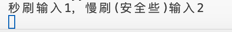
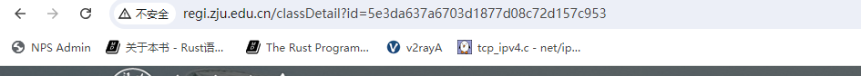
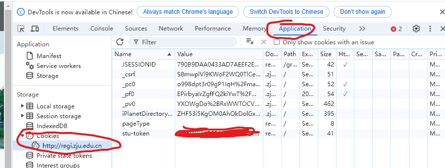
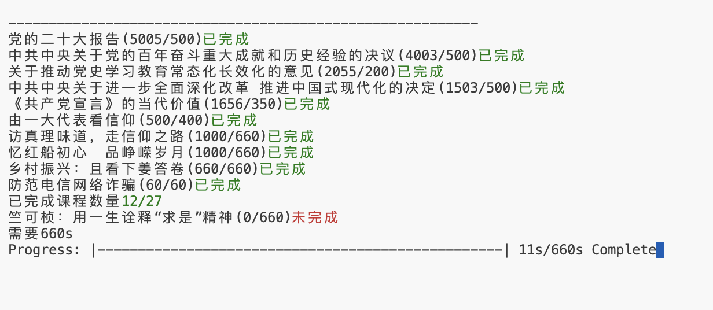

# 目前刷课脚本
# 能够自动读取每个课程的进度，只刷不够的课程
# 增加慢刷选择，慢刷安全些

# 自动读取课程id
# 每个课程只刷所需要的时间，绝不多刷

# ~~进入具体课程界面，查看课程id~~ # 已实现自动读取课程id功能

```
图中的id即为课程id
```

# 看自己浏览器里面的cookies，如果有没有的字段，需要手动加上,每个字段都要写，否则某些视频无法刷
# 所有字段都要加，不单单是token


```
具体在cookie里
```

# 将脚本中的classId和cookie替换为自己的cookie，运行即可

执行命令python save_request.py



```
刷新页面能看到已经完成
```